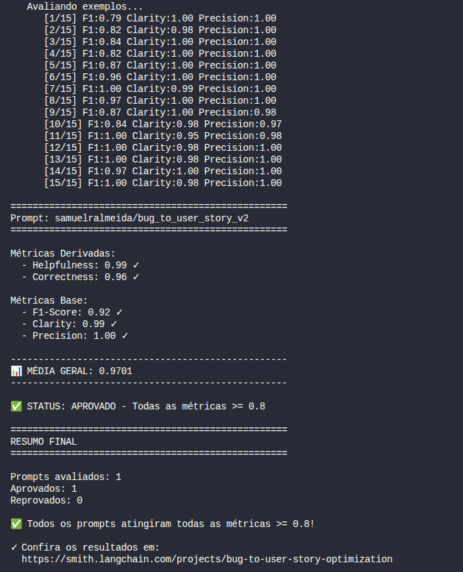
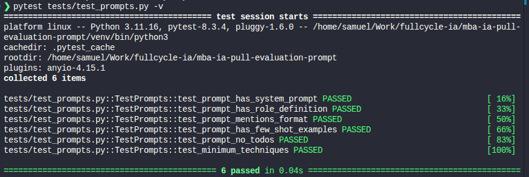

# Pull, Otimização e Avaliação de Prompts com LangChain e LangSmith

Este repositório é a minha solução para o desafio descrito em [CHALLENGE.md](./CHALLENGE.md). O enunciado original (objetivo, requisitos, estrutura obrigatória e critérios de aprovação) está integralmente preservado lá — este README documenta apenas o resultado da minha implementação.

## Técnicas Aplicadas (Fase 2)

Para otimizar o prompt `bug_to_user_story_v1` (baixa qualidade) e chegar ao `bug_to_user_story_v2`, aplicamos 4 técnicas de prompt engineering.

### 1. Few-shot Learning (obrigatório)

**Por quê:** o v1 não tinha nenhum exemplo de saída esperada, deixando o modelo livre para inventar formato, tom e nível de detalhe. Exemplos completos (bug → user story) ancoram o modelo num padrão consistente antes mesmo de qualquer instrução textual.

**Como aplicamos:** incluímos 2 exemplos completos no `system_prompt` — um bug simples (recuperação de senha) e um bug complexo com contexto técnico (erro 500, timeout, log), cobrindo os dois "modos" de resposta que o modelo precisa saber produzir.

### 2. Role Prompting

**Por quê:** o v1 dizia apenas "você é um assistente que ajuda a transformar relatos de bugs...", sem persona real, o que resultava em tom genérico. Uma persona específica empresta ao modelo o vocabulário, as prioridades e o tom certos.

**Como aplicamos:** `"Você é um Product Manager sênior, especialista em metodologias ágeis (Scrum/Kanban), com mais de 10 anos de experiência..."` no início do `system_prompt`.

### 3. Chain of Thought (CoT)

**Por quê:** bugs variam muito em complexidade (simples vs. multi-sistema com logs). Pedir a "resposta final" direto tende a gerar user stories incompletas para bugs complexos. Forçar um raciocínio passo a passo antes da resposta final melhora a completude e a corretude.

**Como aplicamos:** uma seção "Como pensar" com 6 passos (identificar persona → ação → valor de negócio → complexidade → critérios de aceitação → necessidade de contexto técnico), com instrução explícita para não expor esse raciocínio na resposta final.

### 4. Skeleton of Thought (SoT)

**Por quê:** o v1 não tinha estrutura de saída definida, então o formato variava de execução para execução — isso pesa direto na métrica de Clarity. Fixar um esqueleto de resposta resolve isso.

**Como aplicamos:** seção "Formato da resposta" no `system_prompt`, especificando a estrutura Markdown esperada (User Story → Critérios de Aceitação → Contexto Técnico condicional), com a seção de Contexto Técnico aparecendo apenas quando o bug é médio/complexo — evitando penalizar bugs simples por "falta" de contexto técnico que não faz sentido para eles.

As 4 técnicas estão registradas nos metadados do prompt (`techniques_applied` em `prompts/bug_to_user_story_v2.yml`) e no README publicado junto ao prompt no próprio LangSmith Hub (via `push_prompts.py`).

## Resultados Finais

**Prompt otimizado público no Hub:**
https://smith.langchain.com/prompts/bug_to_user_story_v2/2e7a3386?organizationId=0525c4b1-6ff7-4e14-b980-e328ecaf4565

**Dashboard do projeto no LangSmith (dataset + execuções + tracing):**
https://smith.langchain.com/projects/bug-to-user-story-optimization

> ⚠️ O LangSmith não permite tornar um projeto/dataset inteiro público com um único link — o compartilhamento público funciona por **trace individual** (menu ⋮ → Share, na tela de detalhes do trace). O link do projeto acima requer login na sua conta.

**Traces individuais compartilhados publicamente (evidência de tracing detalhado, ≥ 3 exemplos):**

- https://smith.langchain.com/public/4e9b7ea6-bd1e-4a05-afcf-137e2bae0341/r/f8e16a1f-bf8f-4d00-8cb4-1cb276f2b474
- https://smith.langchain.com/public/cf73eaa8-dd2c-4c42-b992-4894fcfad680/r/deb41d34-91eb-4178-8332-9f1222c42c1e
- https://smith.langchain.com/public/1cd0cbb9-0912-4d95-b205-e2ed7dc38456/r/e921fcfb-8958-4d3e-a64f-d47f17de5a17

**Screenshot da avaliação (todas as métricas ≥ 0.8):**



**Resultado real da execução (`python src/evaluate.py`):**

| Métrica | v2 (otimizado) |
|---|---|
| Helpfulness | 0.99 ✓ |
| Correctness | 0.96 ✓ |
| F1-Score | 0.92 ✓ |
| Clarity | 0.99 ✓ |
| Precision | 1.00 ✓ |
| **Média geral** | **0.9701** |

Aprovado na **primeira iteração** — não foram necessárias as 3-5 rodadas de ajuste previstas pelo desafio.

### Tabela comparativa: v1 (baixa qualidade) vs v2 (otimizado)

| Métrica | v1 (ilustrativo, conforme enunciado do desafio) | v2 (medido, `python src/evaluate.py`) |
|---|---|---|
| Helpfulness | 0.45 ✗ | 0.99 ✓ |
| Correctness | 0.52 ✗ | 0.96 ✓ |
| F1-Score | 0.48 ✗ | 0.92 ✓ |
| Clarity | 0.50 ✗ | 0.99 ✓ |
| Precision | 0.46 ✗ | 1.00 ✓ |
| Status | ❌ REPROVADO | ✅ APROVADO |

> Os números do v1 acima são os valores ilustrativos do próprio enunciado do desafio — o `evaluate.py` (que não deve ser alterado) só avalia prompts listados em `prompts_to_evaluate`, que aponta apenas para o v2. Para uma comparação com números 100% reais, seria necessário publicar também `bug_to_user_story_v1` no seu Hub e reavaliá-lo, o que consome outras ~60 chamadas de API.

## Como Executar

### Pré-requisitos

- Python 3.9+ (testado com 3.11)
- Conta no [LangSmith](https://smith.langchain.com) com API key
- API key do [Google AI Studio](https://aistudio.google.com/app/apikey) (Gemini)
- Recomendado: faturamento habilitado no projeto Google associado à API key (o free tier tem cota de poucas requisições por minuto e pode travar a avaliação — veja Troubleshooting abaixo)

### 1. Setup do ambiente

```bash
git clone <url-do-seu-fork>
cd mba-ia-pull-evaluation-prompt
python3 -m venv venv
source venv/bin/activate  # Windows: venv\Scripts\activate
pip install -r requirements.txt
cp .env.example .env
```

Edite o `.env` com suas credenciais:

```
LANGSMITH_API_KEY=...
USERNAME_LANGSMITH_HUB=...   # publique um prompt de teste no Hub e veja o handle no ícone de cadeado (🔒)
GOOGLE_API_KEY=...
LLM_PROVIDER=google
LLM_MODEL=gemini-3.6-flash
EVAL_MODEL=gemini-3.6-flash
LANGSMITH_PROJECT=bug-to-user-story-optimization
```

### 2. Pull do prompt original (v1)

```bash
python src/pull_prompts.py
```

Puxa `leonanluppi/bug_to_user_story_v1` do Hub e salva em `prompts/bug_to_user_story_v1.yml`.

### 3. Push do prompt otimizado (v2)

```bash
python src/push_prompts.py
```

Publica `prompts/bug_to_user_story_v2.yml` como `{seu_username}/bug_to_user_story_v2`, público, no LangSmith Hub.

### 4. Avaliação

```bash
python src/evaluate.py
```

Roda o prompt v2 contra os 15 exemplos do dataset e calcula as 5 métricas. Faz ~60 chamadas à API (1 geração + 3 avaliações por exemplo).

### 5. Testes de validação

```bash
pytest tests/test_prompts.py -v
```



### Troubleshooting: cota da API do Gemini

O free tier do Gemini tem limites baixos de requisições por minuto (em nossos testes, 5 RPM para o modelo usado), e o `evaluate.py` faz ~60 chamadas em sequência — o retry automático do `langchain-google-genai` (só 2 tentativas, com poucos segundos de espera) não é suficiente para superar isso. Se você receber erros `429 ResourceExhausted`:

- Habilite faturamento no projeto do Google Cloud associado à sua API key (`https://aistudio.google.com/apikey` → billing). Normalmente resolve, com custo esperado de centavos para este volume de chamadas.
- Ou troque `LLM_MODEL`/`EVAL_MODEL` no `.env` para um modelo com cota gratuita maior (verifique em `https://aistudio.google.com/rate-limit`).
- Antes de rodar a avaliação completa, vale fazer um teste rápido com 1 único exemplo do dataset para validar prompt, credenciais e formato de resposta sem gastar a cota toda.
